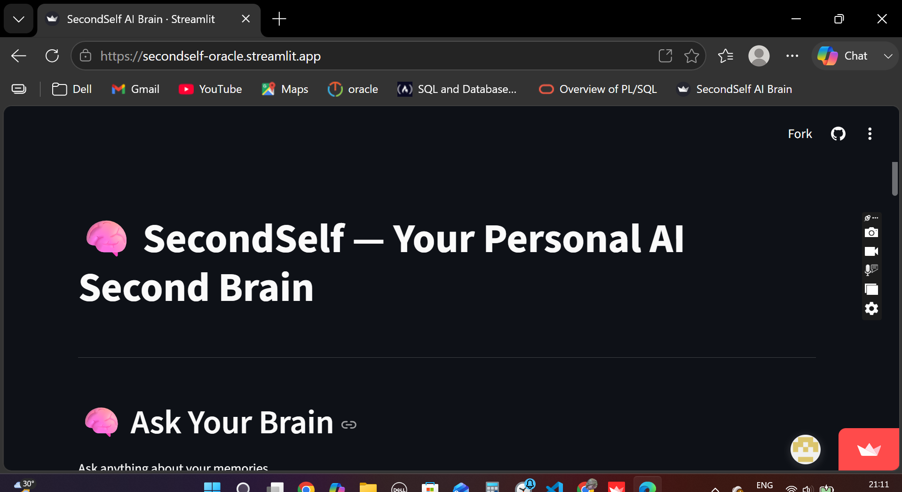

# 🧠 SecondSelf — Your Personal AI Second Brain

SecondSelf is an AI-powered personal knowledge management system that helps you capture, organize, visualize, and search your personal knowledge.

Instead of storing notes that are never used again, SecondSelf turns your memories into a searchable AI knowledge system and allows you to ask questions in natural language.

---

## 🚀 Live Demo

Try SecondSelf AI Brain:

https://secondself-oracle.streamlit.app/

---

## ✨ Features

* 📝 Capture notes, links, and files
* 🧠 Semantic Search using Sentence Transformers
* 🔍 Ask Your Brain using Retrieval-Augmented Generation (RAG)
* 🤖 AI-powered answers using Groq API
* 🌐 Interactive Knowledge Graph visualization
* 🔗 Automatic relationship discovery using embeddings
* 📚 Source-based memory retrieval
* ⚡ Streamlit-based user interface

---

## 🛠 Tech Stack

* Python
* Streamlit
* Sentence Transformers
* Groq API
* Retrieval-Augmented Generation (RAG)
* NumPy
* scikit-learn
* Vis Network
* HTML / CSS / JavaScript

---

## 📂 Project Structure

```text
second-self/
│
├── raw/
├── wiki/
├── embeddings/
├── static/
│   └── graph.html
│
├── app.py
├── ask.py
├── capture.py
├── embed.py
├── search_memory.py
├── graph.json
├── requirements.txt
└── README.md
```

---

## 🚀 Running Locally

Clone the repository:

```bash
git clone https://github.com/irenejoy5349/secondself.git
cd secondself
```

Create a virtual environment:

```bash
python -m venv .venv
```

Activate it:

Windows:

```bash
.venv\Scripts\activate
```

Install dependencies:

```bash
python -m pip install -r requirements.txt
```

Run the application:

```bash
python -m streamlit run app.py
```

---

## 🧠 Example Questions

You can ask SecondSelf:

* What course am I doing?
* What am I learning?
* What projects did I start?
* Summarize my memories.
* What do you know about me?
* What did I learn about LangChain?

---

## 📸 Demo

### Application Preview


The application provides:

* 🧠 Ask Your Brain interface
* 🔍 Semantic Memory Search
* 🕸 Interactive Knowledge Graph
* 📚 AI-generated answers with source memories

---

## 🔮 Future Improvements

* Automatic memory updates
* Better RAG pipeline
* Multi-document support
* PDF understanding
* Memory editing
* Advanced memory personalization
* Better conversation history
* User authentication

---

## 👨‍💻 Author

**Devi**

Built as part of the IIT Patna × Masai AI/ML Program.
